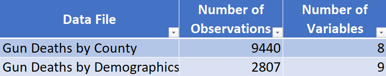

# Title of your Project: Project Proposal

**TODO**: Edit this file. Your project proposal goes here.

For what to do, see the [`../instructions/`](../instructions/) directory, specifically:

* [Design Brief](../instructions/project-design-brief.pdf)
* [Project Proposal Requirements](../instructions/p01-proposal-requirements.md)

# Gun Violence in the United States: Project Proposal

**Author:** Delaney Wu (delaneyw@uw.edu),  Bich Ngoc (Jada) Nguyen (bndn13@uw.edu), Felix Ung (felixung@uw.edu), Anna Voloshina (aev01@uw.edu)

INFO-201: Technical Foundations of Informatics  
The Information School  
University of Washington  
Autumn 2022

## Abstract
Our main question is: “how is gun violence affected by the demographics of race/ethnicity and gender?” This question is important because it allows us to see what groups are targeted by gun violence. To address this question, we will analyze the difference between the deaths of individuals of different racial identity and gender.

**Keywords:** Gun Violence, Race/Ethnicity, Gender

## Introduction
In this project, we will examine the distribution of gun violence – including “homicide, violent crime, attempted suicide, suicide, and unintentional death and injury” (AAFP, 2018) across the United States demographically in terms of race and gender. Gun violence threatens the health and safety of all Americans: “Every day in the United States, 93 people die from gunshot wounds and an additional 240 sustain gunshot injuries” (OJJDP).Therefore, this is an extremely important issue to all Americans, and so, through this project, we hope to break things down to better understand which groups are more severely affected by gun violence. There is no solution to this problem yet, so we would like to shed some light on the severity of the gun violence situation within the US.

## Problem Domain
### Project Framing
The problem domain in this project is gun violence. Gun violence has long been a social issue in the United States. It is experienced everywhere in the U.S. “by people of all ages, races and backgrounds, [but] the problem disproportionately impacts people of color” (Redd, 2021). By analyzing the data set, we aim to demonstrate how gun violence is affecting men and women of different races.

### Human Values
Human values that are within and/or connected to gun violence are protection, self-defense, quality of life, and safety. Having access to guns is a right provided to people in the US for self-defense and protection. Yet some take advantage of these rights to cause harm to others which affects their quality of life and safety.

### Stakeholders
The **direct stakeholders** of this project are the men and women that are affected by gun violence due to their race and gender.  
The **indirect stakeholders** of this project are everyone who is not physically involved but have the risk of experiencing gun violence

### Benefits & Harm
Through the visualization and analysis of gun violence data, we can inform and educate people about the consequences of ignorant and unlawful use of guns and firearms. By presenting these data to people living in regions and communities with frequent gun violence occurring, we can help provide them with information to better understand and minimize future incidences of gun violence. Allowing people to view the data for themselves can help reduce misconceptions that hinder our ability, as a nation, to develop effective gun violence prevention efforts.

## Research Questions
- How does gender affect the number of deaths from gun violence?  

  Through the question and dataset, we are trying to show what kind of role gender has in gun violence. This question is important because it allows us to see which gender is more targeted and affected by gun violence. In the past, men have been known to be victims and perpetrators of gun violence at a shockingly disproportionate rate (Lawrence, 2022). Through this analysis, we would like to shine some light on this preconceived notion.
- How does race affect the number of deaths from gun violence?

  Similar to how gender is linked to gun violence, race is another demographic that has long been an issue related to gun violence within the United States. Previously, it has been shown that people of color are more targeted in gun violence due to weak gun laws, systematic racial inequities, etc. (Edmund, 2022) Therefore, through this question and the dataset, we will try to show what role race/ethnicity plays in gun violence.

- How does the intersectionality of racial and gender identities affect deaths due to gun violence?  

  This question combines the previous two research questions to show how both of the demographics intersect and how that affects the deaths from gun violence in America. It lets us analyze and and have a deeper understanding of which specific group of people is more affected by the social issue of gun violence.

## The Dataset
The data set we chose shows the demographics of gun violence. This provides us with the information to answer our research questions because the data is broken down to show the deaths from gun violence in different columns. There is data on the different races and genders and is split up individually by state.

*Figure 1.* Table of datsets

EveryTownResearch (2022) Gun Violence Overview [Data Set] https://everystat.org/methodology

The data was collected by EveryTown. The data specific to this set was collected from 2016 - 2020. The purpose of this set is to visualize the number of deaths that happen as a result of gun violence, they seek to help understand the causes of gun violence to find evidence-based solutions to help with the gun crisis in America. Everytown has support funds where they collect donations to help support their research, they also have people who volunteer to help their cause. Communities everywhere who face the dangers of gun violence are the ones who should benefit from this data. It is meant to help find evidence to prove that laws around guns in America need to be changed. The data they collect are from sources like “Centers for Disease Control and Prevention”, and ‘National Center for Health Statistics”. The sources are government based so most would believe it would be closest to accurate. We obtained the data by searching through the web for data sets related to gun violence. We credit the source of data because they have many other data sets focused on similar topics and the sources they link are usually other credible sources.

## Expected Implications
Possible implications of this project may include findings that show how certain race/ethnicity is more targeted by gun violence compared to others. It may also show that one gender might be more affected by gun violence than others. By analyzing the intersection between these two demographics, policymakers can use the data to create better policies that can aid and prevent the harm being done to the groups that are affected by the violence. Technologists can also use the data to understand and create more accessible information and services concerning gun safety that can be understood by people of diverse backgrounds. Gun users can view the data and reflect on how they use guns and stay informed with safety precautions and measures of gun and firearm usage in the future. General viewers can use this data to see if their racial group and gender group fall into the danger zone so they can better prepare for gun encounters in the future.

## Limitations
Some limitations we might face in this project concerns the data that we use. Our data sets only span four years, from 2016-2020. Another limitation could be that the data set does not account for every gun violence incidence and therefore can make our analysis somewhat less accurate. In addition, the dataset only provides two genders, male and female, and another group, all genders. It is difficult to understand what is implied in the all genders category, and therefore this data might not be able to represent the whole population of people that are affected by gun violence in the United States. One other way that our project might have limitations is that it only focuses on two specific demographics of race and gender and not other types of demographics such as age, income, education etc.

## References
- Lawrence, H. (2022, March 29). Toxic masculinity and gender-based Gun Violence in America: A way forward. SSRN. Retrieved October 31, 2022, from https://papers.ssrn.com/sol3/papers.cfm?abstract_id=4032043
- Woodcome, Tricia, et al. “Gun Violence Disproportionately and Overwhelmingly Hurts Communities of Color.” Center for American Progress, 3 June 2022, https://www.americanprogress.org/article/gun-violence-disproportionately-and-overwhelmingly-hurts-communities-of-color/.
- “Gun Violence, Prevention of (Position Paper).” AAFP, 12 Dec. 2019, https://www.aafp.org/about/policies/all/gun-violence.html.
- Redd, Kandace. “Gun Violence Disproportionately Impacts People of Color: Guns and Race.” abc10, 19 Nov. 2021, https://www.abc10.com/article/news/community/race-and-culture/how-gun-violence-is-a-racial-justice-issue/103-a6fbca38-b3c6-4c56-a239-e428c71d0d24.
- Introduction to Gun Violence, OJJDP, https://ojjdp.ojp.gov/sites/g/files/xyckuh176/files/pubs/gun_violence/intro.html.
- “Everytown Research - Data and Sources.” EveryStat.org, https://everystat.org/methodology. 
